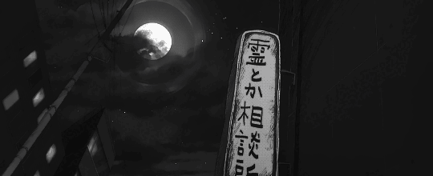

<!--  -->

 

  |  |  |
| :-: | :-: | 

### 
<strong>྾ About me ྾</strong>

-  Hi! I’m **Vinícius Lima** and I am a *Full-Stack Developer*  
-  Passionate about **Front-End Development** with a strong eye for **UI/UX Design**  
-  Currently diving deeper into **TypeScript**, **Next.js**, and **modern JavaScript frameworks**  
-  Focused on building **clean**, **responsive**, and **user-centric** interfaces  
-  Comfortable with tools like **Tailwind CSS**, **Figma**, and **Vite**  
-  Check out my [portfolio](https://www.morusudev.com.br)!
  

### 
<strong>྾ Tech Stack ྾</strong>

#### » Front-End:

#### » Back-End:

#### » Tools & Others:

  

### 
<strong>྾ Contact me ྾</strong>

  
  
  
  
  

  

<!-- Snake contribution grid animation (optional) -->
<!--
<picture align="center">
  <source media="(prefers-color-scheme: dark)" srcset="https://raw.githubusercontent.com/morusudev/morusudev/output/github-contribution-grid-snake-dark.svg">
  <source media="(prefers-color-scheme: light)" srcset="https://raw.githubusercontent.com/morusudev/morusudev/output/github-contribution-grid-snake.svg">
  
</picture>
-->

